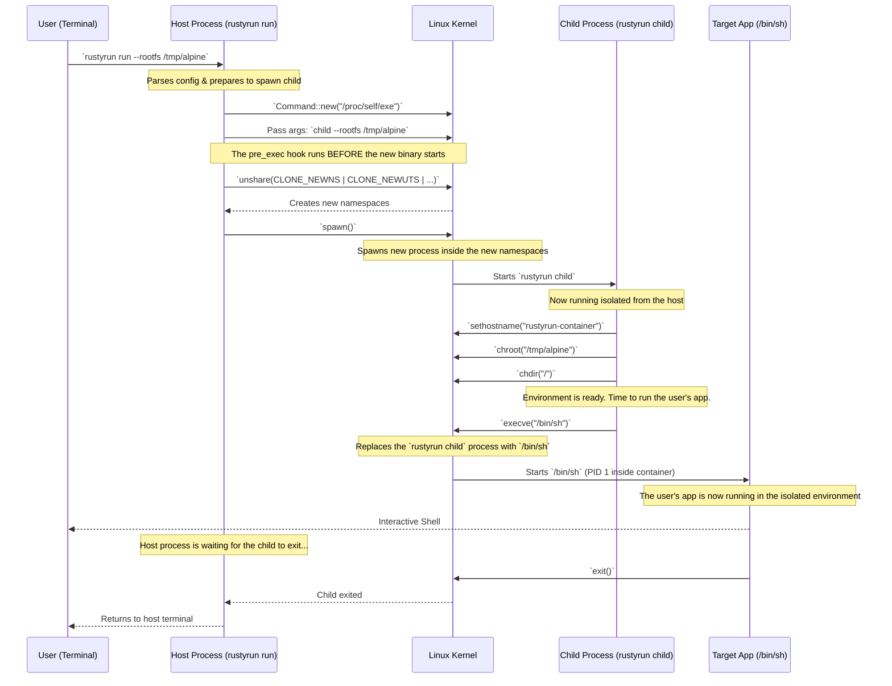

# Architecture Diagram: The "Fork" Execution Model

This diagram illustrates how `rustyrun` uses the "self-execution" trick to isolate a process using Linux namespaces.

```mermaid
sequenceDiagram
    participant User as User (Terminal)
    participant Host as Host Process (rustyrun run)
    participant Kernel as Linux Kernel
    participant Child as Child Process (rustyrun child)
    participant App as Target App (/bin/sh)

    User->>Host: `rustyrun run --rootfs /tmp/alpine`
  
    Note over Host: Parses config & prepares to spawn child
  
    Host->>Kernel: `Command::new("/proc/self/exe")`
    Host->>Kernel: Pass args: `child --rootfs /tmp/alpine`
  
    Note over Host,Kernel: The pre_exec hook runs BEFORE the new binary starts
  
    Host->>Kernel: `unshare(CLONE_NEWNS | CLONE_NEWUTS | ...)`
    Kernel-->>Host: Creates new namespaces
  
    Host->>Kernel: `spawn()`
  
    Note over Kernel: Spawns new process inside the new namespaces
  
    Kernel->>Child: Starts `rustyrun child`
  
    Note over Child: Now running isolated from the host
  
    Child->>Kernel: `sethostname("rustyrun-container")`
    Child->>Kernel: `chroot("/tmp/alpine")`
    Child->>Kernel: `chdir("/")`
  
    Note over Child: Environment is ready. Time to run the user's app.
  
    Child->>Kernel: `execve("/bin/sh")`
  
    Note over Kernel: Replaces the `rustyrun child` process with `/bin/sh`
  
    Kernel->>App: Starts `/bin/sh` (PID 1 inside container)
  
    Note over App: The user's app is now running in the isolated environment
  
    App-->>User: Interactive Shell
  
    Note over Host: Host process is waiting for the child to exit...
  
    App->>Kernel: `exit()`
    Kernel-->>Host: Child exited
    Host-->>User: Returns to host terminal
```
