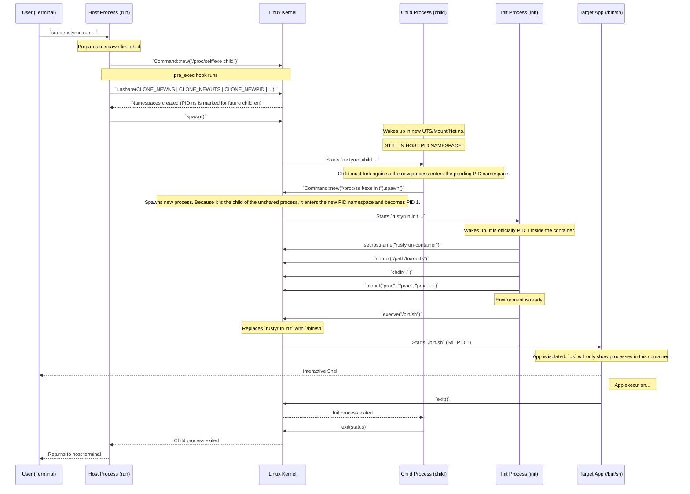

# Architecture Diagram: The "Double Fork" Execution Model

This diagram illustrates how `rustyrun` solves the PID Namespace limitation using a "double fork" architecture. This is necessary because `unshare(CLONE_NEWPID)` only applies to future children, not the calling process.

