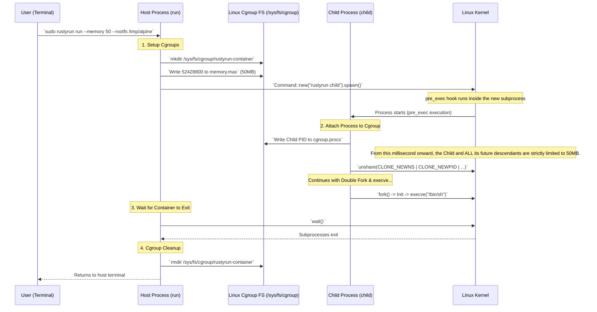

# Architecture Diagram: Integrating Cgroups v2

This diagram illustrates how `rustyrun` implements resource limitations using Linux Cgroups v2, mimicking how `runc` and Docker handle it. The critical part is assigning the limit *before* the child process executes the user's workload.

