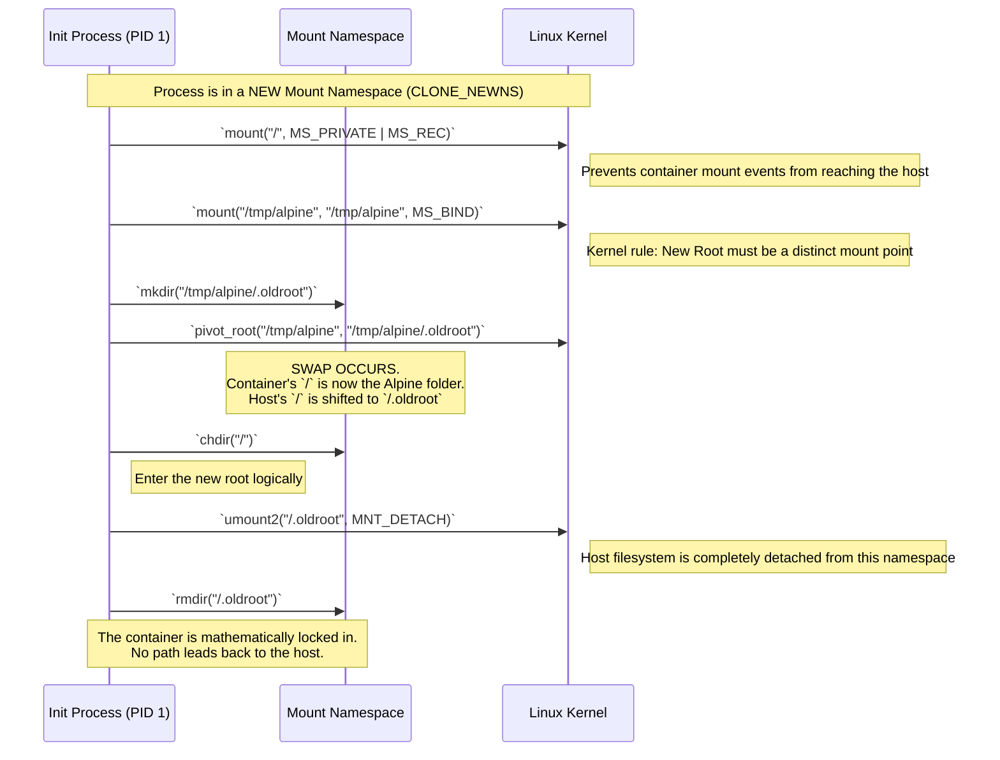

# Architecture Diagram: Filesystem Isolation (`pivot_root` vs `chroot`)

This diagram illustrates how `rustyrun` transitions from using the insecure `chroot` command to the highly secure `pivot_root` syscall to isolate the container's filesystem.

---

### Sequence View

