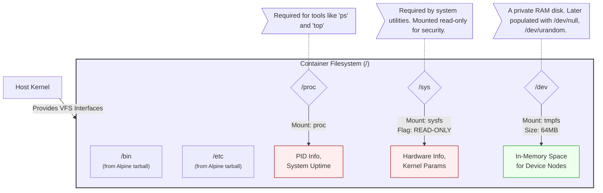

# Architecture Diagram: Populating the Container OS

This diagram illustrates how `rustyrun` populates the container's root file system with the three essential pseudo-filesystems (`/proc`, `/sys`, and `/dev`) immediately after isolating the root directory via `pivot_root`. This step transforms an empty directory of files into a functioning, dynamic operating system.

