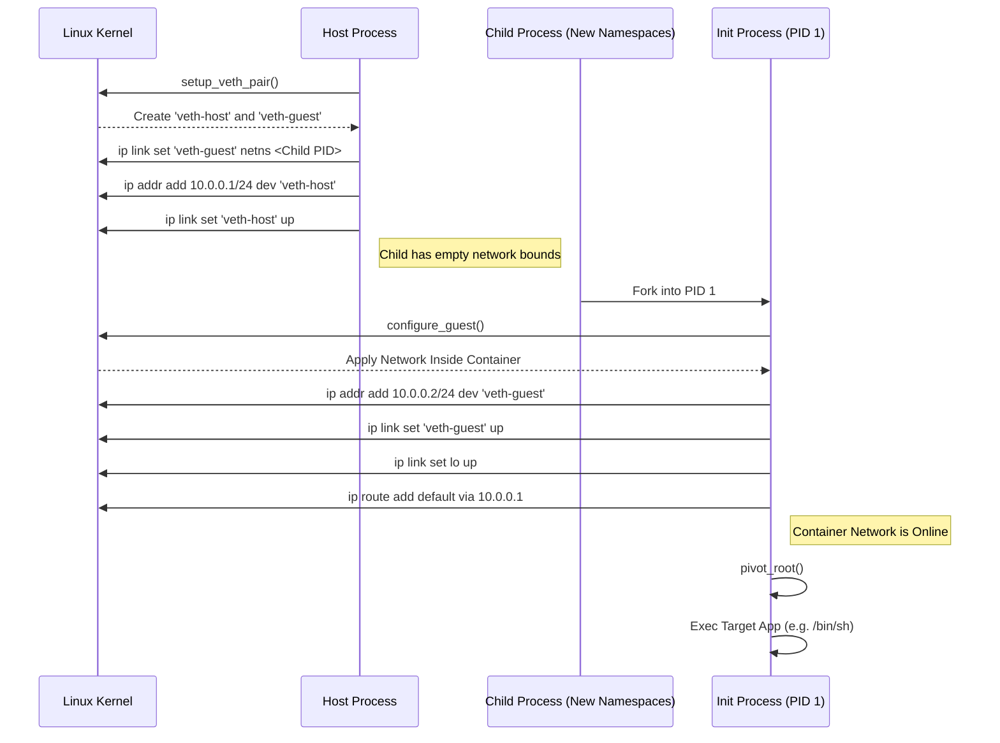

# Container Architecture: Step 06 - Networking (veth pairs)

```mermaid
sequenceDiagram
    participant OS as Linux Kernel
    participant Host as Host Process
    participant Child as Child Process (New Namespaces)
    participant Init as Init Process (PID 1)
    
    Host->>OS: setup_veth_pair()
    OS-->>Host: Create 'veth-host' and 'veth-guest'
    Host->>OS: ip link set 'veth-guest' netns <Child PID>
    Host->>OS: ip addr add 10.0.0.1/24 dev 'veth-host'
    Host->>OS: ip link set 'veth-host' up
    
    note right of Host: Child has empty network bounds
    Child->>Init: Fork into PID 1
    
    Init->>OS: configure_guest()
    OS-->>Init: Apply Network Inside Container
    Init->>OS: ip addr add 10.0.0.2/24 dev 'veth-guest'
    Init->>OS: ip link set 'veth-guest' up
    Init->>OS: ip link set lo up
    Init->>OS: ip route add default via 10.0.0.1
    
    note right of Init: Container Network is Online
    Init->>Init: pivot_root()
    Init->>Init: Exec Target App (e.g. /bin/sh)
```
