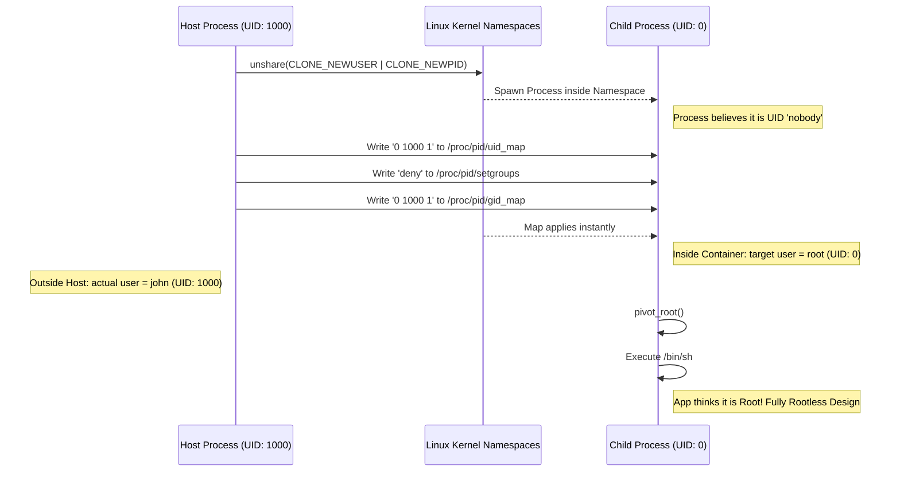

# Container Architecture: Step 08 - User Namespaces

```mermaid
sequenceDiagram
    participant HostProcess as Host Process (UID: 1000)
    participant NSNamespace as Linux Kernel Namespaces
    participant ChildProc as Child Process (UID: 0)

    HostProcess->>NSNamespace: unshare(CLONE_NEWUSER | CLONE_NEWPID)
    NSNamespace-->>ChildProc: Spawn Process inside Namespace
    Note right of ChildProc: Process believes it is UID 'nobody'
    
    HostProcess->>ChildProc: Write '0 1000 1' to /proc/pid/uid_map
    HostProcess->>ChildProc: Write 'deny' to /proc/pid/setgroups
    HostProcess->>ChildProc: Write '0 1000 1' to /proc/pid/gid_map
    
    NSNamespace-->>ChildProc: Map applies instantly
    Note right of ChildProc: Inside Container: target user = root (UID: 0)
    Note left of HostProcess: Outside Host: actual user = john (UID: 1000)
    
    ChildProc->>ChildProc: pivot_root()
    ChildProc->>ChildProc: Execute /bin/sh
    Note right of ChildProc: App thinks it is Root! Fully Rootless Design
```
