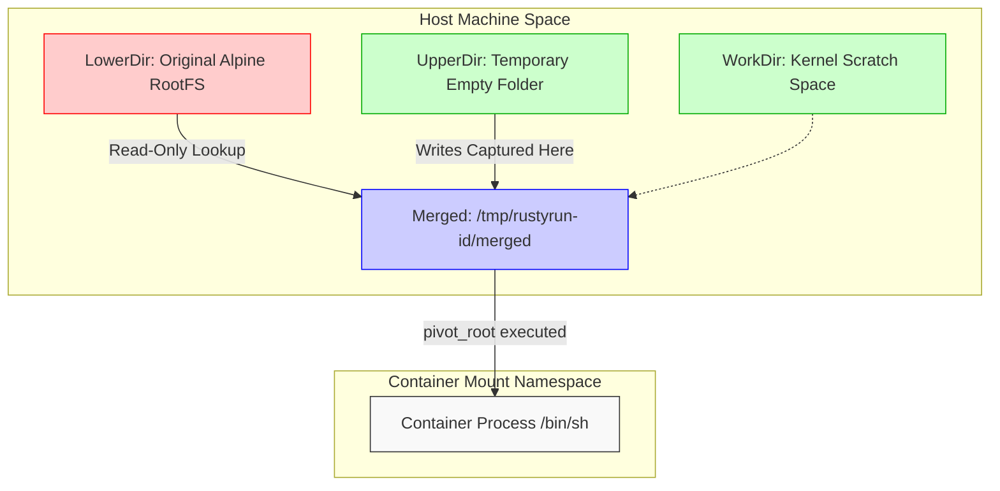

# Container Architecture: Step 09 - OverlayFS

```mermaid
graph TD
    classDef readOnly fill:#ffcccc,stroke:#ff0000;
    classDef write fill:#ccffcc,stroke:#00aa00;
    classDef merge fill:#ccccff,stroke:#0000ff;
    classDef containerLayer fill:#f9f9f9,stroke:#333;

    A[LowerDir: Original Alpine RootFS]:::readOnly
    B[UpperDir: Temporary Empty Folder]:::write
    C[WorkDir: Kernel Scratch Space]:::write
    
    A -->|Read-Only Lookup| M[Merged: /tmp/rustyrun-id/merged]:::merge
    B -->|Writes Captured Here| M
    C -.-> M
    
    subgraph Host Machine Space
    A
    B
    C
    M
    end
    
    subgraph Container Mount Namespace
    P[Container Process /bin/sh]:::containerLayer
    end
    
    M -->|pivot_root executed| P
```